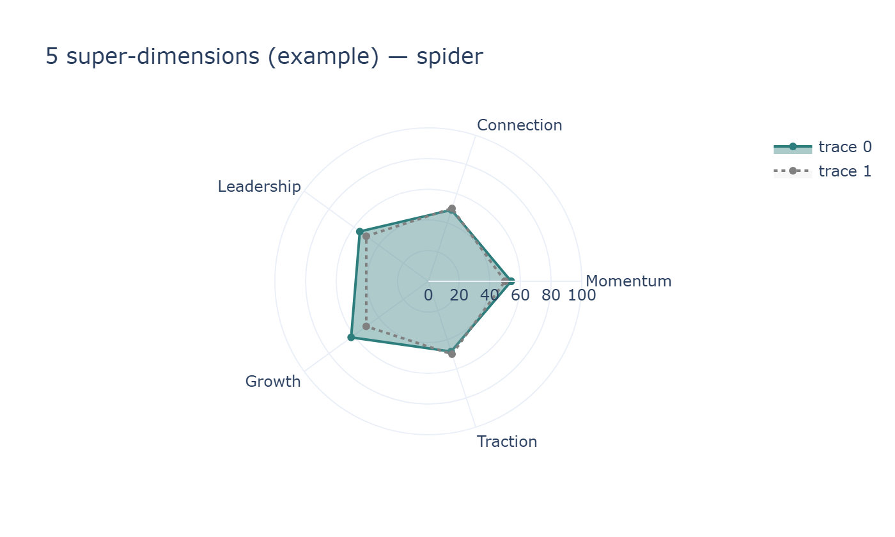
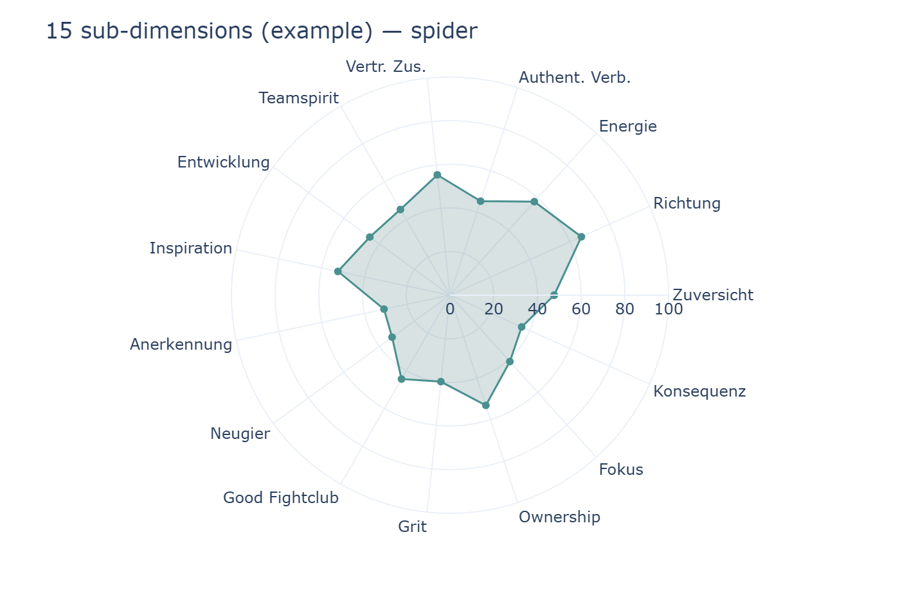

# Organizational Culture Dashboard — Product & Data Spec

**For the reader:** This document describes what the dashboard is, what each part shows and does, and what input data it needs. It is written for someone rebuilding the dashboard; implementation choices are left to you. The dashboard is **read-only** and does not compute statistics — it displays precomputed results from a single JSON payload (and optional assets).

---

## Table of contents

1. [Idea and fractal nature](#1-idea-and-fractal-nature)
2. [Sunburst: structure and navigation](#2-sunburst-structure-and-navigation)
3. [What results show (scores, bars, spiders)](#3-what-results-show-scores-bars-spiders)
4. [Forest plots at every level](#4-forest-plots-at-every-level)
5. [Specific features (Find your superstars)](#5-specific-features-find-your-superstars)
6. [Bayesian “Nerd view” (Statistical detail)](#6-bayesian-nerd-view-statistical-detail)
7. [Input data (what the dashboard needs)](#7-input-data-what-the-dashboard-needs)
8. [Page structure](#8-page-structure)
9. [What each chart and section does](#9-what-each-chart-and-section-does)
10. [Explainability and in-context help](#10-explainability-and-in-context-help)
11. [Data types reference](#11-data-types-reference)
12. [Chart types reference (with “How to explain it”)](#12-chart-types-reference-with-how-to-explain-it)
13. [Data contract (TypeScript)](#13-data-contract-typescript)
14. [Minimal example payload](#14-minimal-example-payload)
15. [Glossary](#15-glossary)
16. [Edge cases and robustness](#16-edge-cases-and-robustness)
17. [Quick reference](#17-quick-reference)

---

## 1) Idea and fractal nature

The dashboard applies the **same model** everywhere: **5 super-dimensions** and **15 sub-dimensions** of organizational culture, on a **0–100** scale. That model is used from a small team up to the whole organization. At every level you see the **same pattern**:

- **One unit** with a culture profile (scores on 5 super- and 15 sub-dimensions, with optional uncertainty).
- **Its children** compared in a forest-style chart (e.g. divisions under the org, departments under a division, teams under a department, optionally individuals under a team).

So the UI is **fractal**: the same “profile view + child comparison” pattern repeats whether you are looking at the organization, a division, a department, or a team. Users learn one interaction model and reuse it at every level.

---

## 2) Sunburst: structure and navigation

The org structure is shown as a **sunburst** (or similar hierarchy viz): root = organization, then divisions, then departments, then teams. The chart must show an **actual organizational structure** — multiple divisions, multiple departments per division, and multiple teams per department — so users can see and navigate a real hierarchy, not a single node per level. **Clicking a slice** sets the drill-down context to that unit (the view recenters on the clicked unit and shows its children); **clicking the center** goes back one level (e.g. from a division to the org). Use sufficient **contrast** (e.g. dark blues or distinct colors per level) so slices are clearly visible on a white background. Names come from the payload’s `by_id` lookup.

**Before click (full org):**


**After click (context = Division A):** The chart recenters on the selected unit; the center is now Division A, with its departments and teams.


---

## 3) What results show (scores, bars, spiders)

Each unit has:

- **15 sub-dimension scores**: means and standard deviations (length-15 arrays), in a fixed order.
- **5 super-dimension scores**: means and standard deviations (length-5), derived as the average of the three sub-dimensions per domain.

All scores are **0–100**. Uncertainty is shown as a **95% credibility interval (CrI)**: mean ± 1.96 × sd, clipped to [0, 100].

**Chart types for the profile:**

- **Grouped horizontal bar chart**: one row per dimension (5 super, then a spacer, then 15 sub). Bar length = score; optional error bars = 95% CrI. Often colored by domain. Background bands can indicate “needs attention” / “neutral” / “good”.


- **Spider (radar) charts**: two charts — one with **5 axes** (super-dimensions), one with **15 axes** (sub-dimensions). Each axis goes from center to value; a neutral reference (e.g. 50) is often shown. Optional CrI band. Spider charts make the **profile shape** visible at a glance (which dimensions are high or low relative to others).
- **Spider comparison**: the same spider chart can support **comparison mode** — overlay multiple units (e.g. two or more teams, or departments) and/or a **benchmark** (e.g. organization mean, division mean, or a target). Each profile is a separate trace with a distinct color and a legend; the benchmark is often drawn with a dashed line. This lets users compare teams to each other and to the parent or org at a glance.






---

## 4) Forest plots at every level

At **every** level the same chart type is used to compare **children** of the current unit:

- **Rows** = children (e.g. divisions, departments, teams, or individuals).
- **Point** = mean for the selected dimension(s).
- **Horizontal interval** = 95% CrI.
- **Vertical reference line** = parent (current unit) mean for that dimension.

So: Organization → compare divisions; Division → compare departments; Department → compare teams; Team → compare individuals (if `respondent_scores` is present).


*Example: forest plot comparing children; vertical line = parent mean.*

---

## 5) Specific features (Find your superstars)

**Find your superstars** is a collapsible block that ranks the **top 3 teams** or **top 3 departments**. The user chooses:

- Level: Teams vs Departments.
- Ranking: “global” (average over 5 super-dimensions) or a single dimension (one of 5 super or 15 sub).

The list shows the top 3 with score and, for teams, optional context (e.g. department, division). Data comes from `hierarchical_result.team` or `department` (means/sds) plus mappings for names and parent context.

---

## 6) Bayesian “Nerd view” (Statistical detail)

The **Statistical detail** tab explains the Bayesian logic and shows **prior vs posterior**:

- **Prior** = belief before data (the model already has a full “measurement” with zero responses).
- **Posterior** = belief after incorporating the survey data.
- Each data point updates the prior toward the posterior. The dashboard can always be populated (with prior only, or with posterior when available).

**Charts in this tab:**

- **Prior vs posterior — 5 super-dimensions**: density curves per super-dimension showing how **more data changes the distributions** — the **prior** (dashed, wide) is the uncertain belief before data; the **posterior** (solid, narrow) is the updated belief after data, tighter and possibly shifted. Means should vary by dimension (not all at 50) so the effect is visible.
- **Prior vs posterior — 15 sub-dimensions**: same idea in a 5×3 grid (or one figure per domain).
- **Statistical drill-down**: level/entity selector; forest plot for the first super-dimension (children vs current unit); distribution summary for the selected unit (e.g. five density curves for super-dimensions).


**Data:** Prior = samples from your prior model (5D and 15D). Posterior = `posterior_theta_org` (`[samples][5]`) and `posterior_theta_sub` (`[samples][15]`) from the payload.

---

## 7) Input data (what the dashboard needs)

### 7.1 Main payload: culture_results.json

The **only required input**. It contains counts, the full hierarchy with scores, optional posterior samples, and optional per-person scores. The org structure (ids, names, parent-child) is **inside** this payload; no separate org file is needed.

**Top-level keys:**

- **summary_stats** — Counts: `n_respondents`, `n_teams`, `n_departments`, `n_divisions`.
- **hierarchical_result** — Org profile, division/department/team profiles, parent-child mappings, and `by_id` for names.
- **posterior_theta_org** — 2D array `[samples][5]` for Statistical tab (super-dimensions).
- **posterior_theta_sub** — 2D array `[samples][15]` for Statistical tab (sub-dimensions).
- **respondent_scores** (optional) — Per-person scores; needed only for showing individuals when drilling into a team.

**hierarchical_result** contains:

- **org**: `mean_sub` (15), `sd_sub` (15), `mean_super` (5), `sd_super` (5).
- **division**: `ids`, `means` (id → 15), `sds` (id → 15).
- **department**: `means`, `sds`, `dept_to_teams`, `dept_to_division`.
- **team**: `means`, `sds`, `team_to_dept`, `team_to_division`.
- **division_to_depts**: division id → list of department ids.
- **by_id**: node id → `{ id, name, level, parent_id, ... }` for display names and hierarchy.

For the **sunburst**, the top-level slice is a synthetic root **"org"**; divisions are its children. All other ids are real node ids from the hierarchy.

**respondent_scores** (when present): `respondent_id`, `team_id`, `theta_sub` (15 per person), `theta_super` (5 per person); optional `employee_id`. When drilling to a team, filter by `team_id`.

### 7.2 Optional assets

- **Icons** for the 5 super-dimensions (e.g. momentum, connection, leadership, growth, traction) for the “Culture at a glance” section.
- **org_hierarchy.json** and **item_bank.json** are **not** required for the dashboard; hierarchy and names come from **hierarchical_result** and **by_id**.

---

## 8) Page structure

- **Sidebar**: Status (e.g. whether results are loaded), plus an expandable **dimension guide** (all 5 super and 15 sub with short descriptions).
- **Main**:
  - Title and short caption.
  - **Top row**: Five metric tiles — Respondents, Teams, Departments, Divisions, Overall culture (0–100).
  - **Expander**: “Find your superstars”.
  - **Two tabs**: **Culture at a glance** | **Statistical detail**.

---

## 9) What each chart and section does

| Section | What it is | What it shows | Data |
|--------|------------|---------------|------|
| **Metric tiles** | Five numbers in a row | Counts from `summary_stats` + overall culture (average of org’s 5 super means) | `summary_stats`, `hierarchical_result.org.mean_super` |
| **Find your superstars** | Collapsible block | Top 3 teams or departments by chosen criterion (global or one dimension) | `hierarchical_result.team` / `department` + mappings |
| **Icons row** | Row of five icons | One icon per super-dimension (when assets provided) | Optional assets |
| **Scores at a glance (org)** | Bar and/or spider | Org profile: 5 super + 15 sub, optional 95% CrI; spider can support comparison (multiple units + benchmark) | `hierarchical_result.org` |
| **How divisions compare** | Forest-style chart | Divisions (+ org row) vs org mean on selected dimension(s) | `division.ids`, `division.means/sds`, org profile |
| **Context selector** | Level + dropdowns | Current “viewing” unit (org / division / dept / team) | `by_id`, hierarchy |
| **Sunburst** | Hierarchy viz | Click slice = set context; click center = go back | `division.ids`, `division_to_depts`, `dept_to_teams`, `by_id` |
| **Scores at a glance (context)** | Same as org-level | Selected unit’s profile (bar/spider, optional CrI); spider can offer comparison (e.g. compare child teams or add parent/org as benchmark) | Org: `hierarchical_result.org`; else `division/ department/team.means[id]`, `sds[id]`; benchmark from parent or org |
| **Forest plot — children** | Forest-style | Children of current unit; point + CrI; reference = current unit mean | Current unit mean/sd; children means/sds from appropriate level |
| **Team profile** (when viewing team) | Five numbers + CrI text | Team’s 5 super means and 95% CrI | Team’s `means`, `sds` from `hierarchical_result.team` |
| **Prior vs posterior (5 super)** | Density curves | Prior vs posterior per super-dimension | Prior: your prior samples; posterior: `posterior_theta_org` |
| **Prior vs posterior (15 sub)** | Grid of density curves | Prior vs posterior per sub-dimension | Prior: 15D samples; posterior: `posterior_theta_sub` |
| **Statistical drill-down** | Selector + forest + curves | Forest for first super (children vs unit); distribution summary for unit | `hierarchical_result`; optional unit-level posterior if available |

---

## 10) Explainability and in-context help

**Principle:** Users should always be able to get an explanation of what any element means — dimensions, charts, and key terms — without leaving the page. The rebuild should offer in-context help (tooltips, “?” icons, expandable dimension guide, “Explain this chart” per chart).

### 10.1 What must be explainable

1. **Dimensions** — Each of the 5 super- and 15 sub-dimensions should have a short description (what it measures, what high/low means). Surface via hover on bar/axis or click on dimension name.
2. **Charts** — Every chart type should have an “Explain this chart” (or equivalent) with a short sentence or two: what the chart shows, what axes/slices/rows mean, how to read it.
3. **Terms** — Credibility interval (CrI), prior, posterior, super-dimension, sub-dimension, drill-down, profile, etc. Definitions are in the [Glossary](#15-glossary); use them in tooltips or a help panel.

### 10.2 Canonical explanation text

**Credibility interval (95% CrI)**  
“The 95% credibility interval (CrI) is the range in which we are 95% confident the true score lies, given the data and our model. A narrower interval means more precise estimates.”

**Prior / posterior**  
“The **prior** is our belief about the scores before we see any survey data. The **posterior** is our updated belief after incorporating the data. Every response shifts the estimate from prior toward the posterior; the dashboard can always show a profile (using prior when there is no data, and posterior when available).”

### 10.3 Dimension descriptions (for UI)

**5 super-dimensions (short labels: Momentum, Connection, Leadership, Growth, Traction):**

1. **Positive Momentum** — The organization’s sense of direction, confidence and energy. High scores indicate clarity of purpose, optimism and sustained drive.
2. **Human Connection** — Quality of relationships, trust and psychological safety. High scores suggest strong collaboration, authenticity and a sense of belonging.
3. **Positive Leadership** — How leaders enable development, inspire and recognise people. High scores point to supportive, visible and appreciative leadership.
4. **Growth Mindset** — Openness to learning, constructive conflict and perseverance. High scores reflect curiosity, resilience and a culture of continuous improvement.
5. **Business Traction** — Ownership, focus and follow-through on outcomes. High scores indicate clear accountability, prioritisation and execution.

**15 sub-dimensions (in fixed order):**

| # | Name | Description |
|---|------|-------------|
| 1 | Zuversicht | Confidence and optimism that the team and organisation can succeed. |
| 2 | Richtung | Clarity of direction and alignment on where the organisation is heading. |
| 3 | Energie | Level of energy and drive that people bring to their work. |
| 4 | Authentische Verbundenheit | Genuine connection and psychological safety among people. |
| 5 | Vertrauensvolle Zusammenarbeit | Trust-based collaboration and reliable cooperation. |
| 6 | Teamspirit | Sense of belonging, mutual support and shared identity in the team. |
| 7 | Entwicklung | Support for personal and professional development and growth. |
| 8 | Inspiration | Leaders and environment that inspire and motivate people. |
| 9 | Anerkennung | Recognition and appreciation of contributions and achievements. |
| 10 | Neugier | Curiosity, openness to new ideas and willingness to experiment. |
| 11 | Good Fightclub | Constructive debate and productive conflict that improve decisions. |
| 12 | Grit | Perseverance, resilience and commitment to long-term goals. |
| 13 | Ownership | Sense of ownership and responsibility for outcomes. |
| 14 | Fokus | Ability to focus on priorities and avoid distraction. |
| 15 | Konsequenz | Consistency and follow-through in execution and decisions. |

---

## 11) Data types reference

| Type | Description |
|------|-------------|
| **Score15** | `number[]` length 15; sub-dimension scores in fixed order (see dimensions above). |
| **Score5** | `number[]` length 5; super-dimension scores (Momentum, Connection, Leadership, Growth, Traction). |
| **SummaryStats** | Counts: `n_respondents`, `n_teams`, `n_departments`, `n_divisions`. |
| **OrgProfile** | `mean_sub`, `sd_sub` (15), `mean_super`, `sd_super` (5). |
| **ByIdNode** | `id`, optional `name`, `level`, `parent_id`; for display and hierarchy. |
| **HierarchicalResult** | `org`, `division`, `department`, `team`, `division_to_depts`, `by_id`. |
| **RespondentScores** | Optional: `respondent_id`, `team_id`, `theta_sub`, `theta_super`; optional `employee_id`. |
| **CultureResults** | Top-level payload: `summary_stats`, `hierarchical_result`, `posterior_theta_org`, `posterior_theta_sub`, optional `respondent_scores`. |

---

## 12) Chart types reference (with “How to explain it”)

| Chart | How to explain it (for UI) |
|-------|----------------------------|
| **Horizontal bar (scores)** | “This chart shows the culture profile: one bar per dimension (5 super-dimensions on top, 15 sub-dimensions below). The length is the score (0–100). Optional error bars show the 95% credibility interval.” |
| **Spider (5 axes)** | “This radar chart shows the five super-dimensions. Each axis is one dimension; the shape shows the profile at a glance. The line connects the scores from the center (0) to the value (0–100); a reference line at 50 is often shown.” |
| **Spider (15 axes)** | “Same as the 5-axis spider but for all 15 sub-dimensions, often colored by domain. It shows the detailed profile shape.” |
| **Spider (comparison)** | “This spider overlays several units (e.g. teams or departments) and optionally a benchmark (e.g. organization or parent mean). Each profile has its own color; the legend identifies who is who. Use it to compare profile shapes across units or against a reference.” |
| **Forest plot** | “Each row is one child unit (e.g. a division or department). The dot is the mean score; the horizontal bar is the 95% credibility interval. The vertical line is the parent (current unit) mean — compare each child to this reference.” |
| **Sunburst** | “This chart shows the organization structure: center = organization, then rings for divisions, departments, and teams. Click a slice to drill into that unit — the view recenters on it and shows its children. Click the center to go back one level.” |
| **Density curves (prior vs posterior)** | “The chart shows how more data changes our uncertainty: the **prior** (dashed, wide) is the belief before data; the **posterior** (solid, narrow) is after incorporating responses — more data tightens the distribution and can shift it. Each dimension can have a different mean (not all at 50). Vertical lines often show median and 95% interval.” |

---

## 13) Data contract (TypeScript)

```ts
export type Score15 = number[];  // length 15, fixed order
export type Score5 = number[];   // length 5

export interface SummaryStats {
  n_respondents: number;
  n_teams: number;
  n_departments: number;
  n_divisions: number;
}

export interface OrgProfile {
  mean_sub: Score15;
  sd_sub: Score15;
  mean_super: Score5;
  sd_super: Score5;
}

export interface ByIdNode {
  id: string;
  name?: string;
  level?: string;
  parent_id?: string | null;
  [k: string]: unknown;
}

export interface HierarchicalResult {
  org: OrgProfile;
  division: {
    ids: string[];
    means: Record<string, Score15>;
    sds: Record<string, Score15>;
  };
  department: {
    means: Record<string, Score15>;
    sds: Record<string, Score15>;
    dept_to_teams: Record<string, string[]>;
    dept_to_division: Record<string, string>;
  };
  team: {
    means: Record<string, Score15>;
    sds: Record<string, Score15>;
    team_to_dept: Record<string, string>;
    team_to_division: Record<string, string>;
  };
  division_to_depts: Record<string, string[]>;
  by_id: Record<string, ByIdNode>;
}

export interface RespondentScores {
  respondent_id: string[];
  employee_id?: string[];
  team_id: string[];
  theta_sub: Score15[];
  theta_super: Score5[];
}

export interface CultureResults {
  summary_stats: SummaryStats;
  hierarchical_result: HierarchicalResult;
  posterior_theta_org: Score5[];
  posterior_theta_sub: Score15[];
  respondent_scores?: RespondentScores;
}
```

---

## 14) Minimal example payload

```json
{
  "summary_stats": {
    "n_respondents": 100,
    "n_teams": 10,
    "n_departments": 3,
    "n_divisions": 1
  },
  "hierarchical_result": {
    "org": {
      "mean_sub": [52, 55, 48, 58, 60, 54, 50, 53, 51, 49, 52, 56, 54, 50, 52],
      "sd_sub": [8, 7, 9, 7, 6, 8, 8, 7, 8, 9, 7, 7, 8, 8, 7],
      "mean_super": [51.67, 57.33, 51.33, 52.33, 52],
      "sd_super": [6.2, 5.1, 6.0, 6.5, 6.2]
    },
    "division": {
      "ids": ["div-1"],
      "means": { "div-1": [52, 55, 48, 58, 60, 54, 50, 53, 51, 49, 52, 56, 54, 50, 52] },
      "sds": { "div-1": [8, 7, 9, 7, 6, 8, 8, 7, 8, 9, 7, 7, 8, 8, 7] }
    },
    "department": {
      "means": {},
      "sds": {},
      "dept_to_teams": {},
      "dept_to_division": {}
    },
    "team": {
      "means": {},
      "sds": {},
      "team_to_dept": {},
      "team_to_division": {}
    },
    "division_to_depts": { "div-1": [] },
    "by_id": {
      "org": { "id": "org", "name": "Organization", "level": "org" },
      "div-1": { "id": "div-1", "name": "Division 1", "level": "division", "parent_id": "org" }
    }
  },
  "posterior_theta_org": [],
  "posterior_theta_sub": []
}
```

(Empty arrays for `posterior_*` and empty maps for department/team are valid; the dashboard shows prior-only or placeholder content where needed.)

---

## 15) Glossary

| Term | Definition |
|------|------------|
| **Benchmark** | A reference profile (e.g. organization mean, division mean, or target) shown on a spider or other chart so users can compare a unit’s scores against it. |
| **Credibility interval (CrI)** | The range in which we are 95% confident the true score lies, given the data and the model. Computed as mean ± 1.96 × sd, clipped to [0, 100]. |
| **Prior** | The model’s belief about scores before any survey data; a full “measurement” exists even with zero responses. |
| **Posterior** | The updated belief after incorporating survey data; each response shifts the estimate from prior toward posterior. |
| **Super-dimension** | One of the five high-level culture domains: Positive Momentum, Human Connection, Positive Leadership, Growth Mindset, Business Traction. |
| **Sub-dimension** | One of the 15 finer dimensions (3 per super-dimension); fixed order in all 15-element vectors. |
| **Drill-down** | Navigating from the organization to a division, department, or team (and optionally to individuals); each level shows the same “profile + child comparison” pattern. |
| **Profile** | The set of scores (5 super and/or 15 sub) for one unit; often shown as a bar chart or spider chart. |
| **Forest plot** | Chart with one row per unit (e.g. child); point = mean, horizontal interval = 95% CrI; vertical reference line = parent mean. |
| **Sunburst** | Circular hierarchy visualization; click slice = set context, click center = go back. |

---

## 16) Edge cases and robustness

- **Missing or incomplete payload:** Show an empty or placeholder state; do not render charts that depend on missing data.
- **No children at a level:** e.g. “No departments in this division” — show a clear message instead of an empty chart.
- **No respondent_scores:** When the user drills to a team, do not show individual rows; show a message that individual scores are not available.
- **Missing name in by_id:** Fall back to the node id for labels.
- **Partial means/sds:** Skip or grey out units that have no data for the chosen dimension.

---

## 17) Quick reference

| Need | Where |
|------|--------|
| Dimension order (15 sub) | [§3](#3-what-results-show-scores-bars-spiders), [§10.3](#103-dimension-descriptions-for-ui) |
| Chart images | `docs/dashboard_spec_images/`: `scores-bar.png`, `spider-5.png`, `spider-15.png`, `spider-5-compare.png`, `forest-plot.png`, `sunburst.png`, `sunburst-after-click.png`, `density-curves.png` |
| Payload shape | [§13](#13-data-contract-typescript), [§14](#14-minimal-example-payload) |
| Explainability copy | [§10](#10-explainability-and-in-context-help), [§12](#12-chart-types-reference-with-how-to-explain-it), [§15](#15-glossary) |
| Hierarchy levels | Org → Division → Department → Team → (optional) Individuals |

To regenerate chart example images: `pip install plotly kaleido` then `python scripts/generate_spec_chart_examples.py` from the project root.
