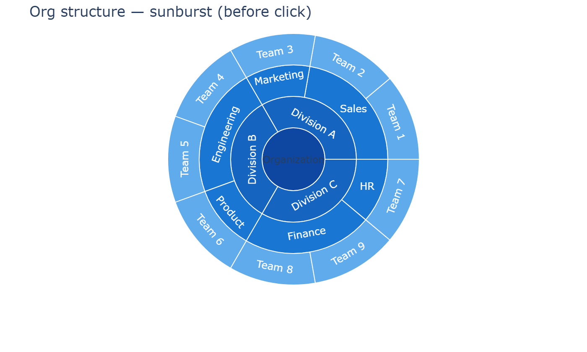
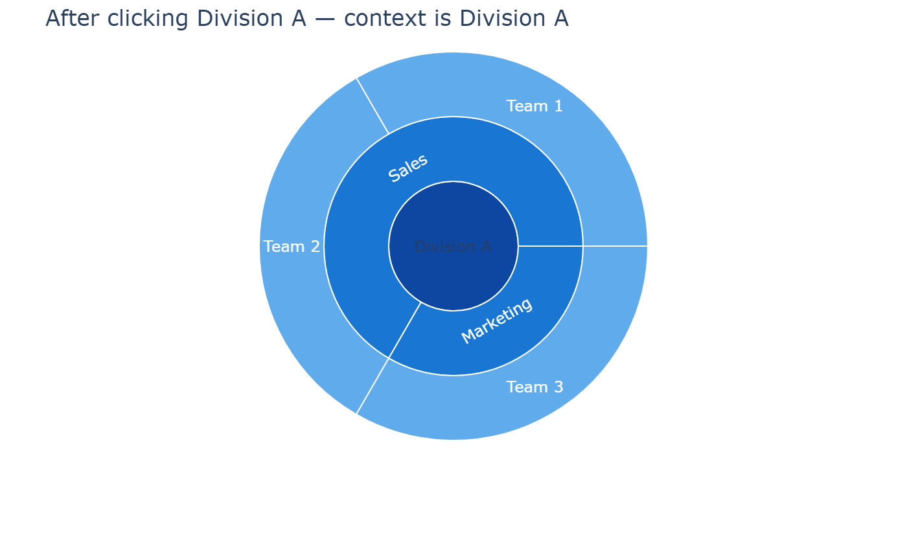
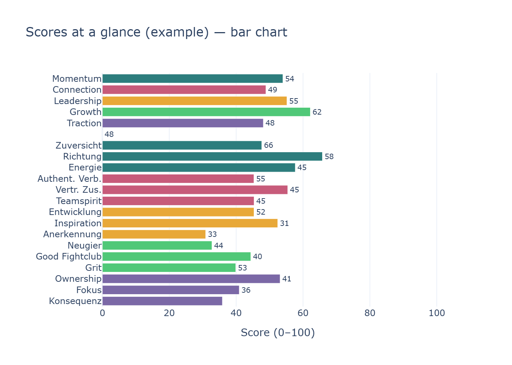
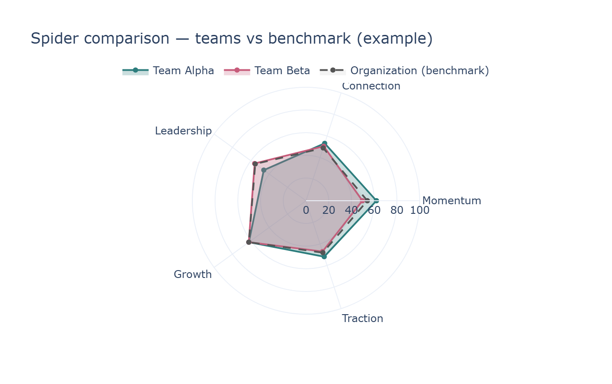
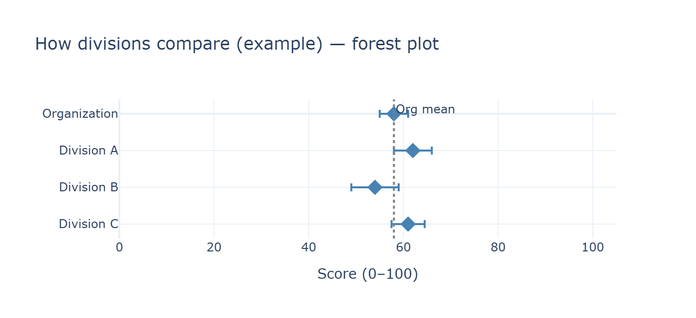
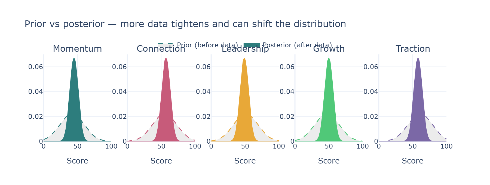

# Organizational Culture Dashboard — Product & Data Spec

**For the reader:** This document describes what the dashboard is, what each part shows and does, and what input data it needs. It is written for someone rebuilding the dashboard; implementation choices are left to you. The dashboard is **read-only** and does not compute statistics — it displays precomputed results from a single JSON payload (and optional assets).

---

## Table of contents

1. [Idea and fractal nature](#1-idea-and-fractal-nature)
2. [Sunburst: structure and navigation](#2-sunburst-structure-and-navigation)
3. [What results show (scores, bars, spiders)](#3-what-results-show-scores-bars-spiders)
4. [Forest plots at every level](#4-forest-plots-at-every-level)
5. [Specific features (Find your superstars)](#5-specific-features-find-your-superstars)
6. [Bayesian “Nerd view” (Statistical detail)](#6-bayesian-nerd-view-statistical-detail)
7. [Input data (what the dashboard needs)](#7-input-data-what-the-dashboard-needs)

---

## 1) Idea and fractal nature

The dashboard applies the **same model** everywhere: **5 super-dimensions** and **15 sub-dimensions** of organizational culture, on a **0–100** scale. That model is used from a small team up to the whole organization. At every level you see the **same pattern**:

- **One unit** with a culture profile (scores on 5 super- and 15 sub-dimensions, with optional uncertainty).
- **Its children** compared in a forest-style chart (e.g. divisions under the org, departments under a division, teams under a department, optionally individuals under a team).

So the UI is **fractal**: the same “profile view + child comparison” pattern repeats whether you are looking at the organization, a division, a department, or a team. Users learn one interaction model and reuse it at every level.

---

## 2) Sunburst: structure and navigation

The org structure is shown as a **sunburst** (or similar hierarchy viz): root = organization, then divisions, then departments, then teams. The chart must show an **actual organizational structure** — multiple divisions, multiple departments per division, and multiple teams per department — so users can see and navigate a real hierarchy, not a single node per level. **Clicking a slice** sets the drill-down context to that unit (the view recenters on the clicked unit and shows its children); **clicking the center** goes back one level (e.g. from a division to the org). Use sufficient **contrast** (e.g. dark blues or distinct colors per level) so slices are clearly visible on a white background. Names come from the payload’s `by_id` lookup.

**Before click (full org):**

**After click (context = Division A):** The chart recenters on the selected unit; the center is now Division A, with its departments and teams.

---

## 3) What results show (scores, bars, spiders)

Each unit has:

- **15 sub-dimension scores**: means and standard deviations (length-15 arrays), in a fixed order.
- **5 super-dimension scores**: means and standard deviations (length-5), derived as the average of the three sub-dimensions per domain.

All scores are **0–100**. Uncertainty is shown as a **95% credibility interval (CrI)**: mean ± 1.96 × sd, clipped to [0, 100].

**Profile (single unit): bar chart**

The dashboard shows one unit's culture profile with a grouped horizontal bar chart: one row per dimension (5 super, then a spacer, then 15 sub). Bar length = score; optional error bars = 95% CrI. Often colored by domain. Background bands can indicate needs attention / neutral / good. In the drill-down (Scores at a glance), only the bar chart is used for the selected unit's profile.

**Comparison: spider charts (one to many profiles)**

**Spider (radar) charts** are used to **compare multiple units** — the same subdivisions you see in the forest plot (e.g. divisions under the org, departments under a division, teams under a department). They are **not** an alternative to the bar chart for showing a single profile; they are the **comparison view** alongside the forest plot.

- In the **"Compare children"** section, the user can switch between **Forest plot** and **Spider chart**. Both show the same entities (children of the current unit).
- The spider shows **one contour (line) per unit**: each subdivision gets its own closed polygon (5 axes for super-dimensions, 15 axes for sub-dimensions), with a distinct color and a legend. So the chart can show **one to many different profiles** in one view — e.g. one line per division, or one per department, or one per team.
- A **neutral reference** (e.g. 50) is often shown as a dotted circle. The **current level (parent)** can be drawn as a dashed reference line so users can compare each child to the parent. Contours are **lines only** (no fill) to keep overlapping profiles readable.
- This makes **profile shape** comparable at a glance: which dimensions are high or low for each unit relative to the others.

*Example: spider chart overlaying multiple units (e.g. teams or departments); each line = one unit; dashed = parent/reference.*

---

## 4) Forest plots at every level

At **every** level the same chart type is used to compare **children** of the current unit:

- **Rows** = children (e.g. divisions, departments, teams, or individuals).
- **Point** = mean for the selected dimension(s).
- **Horizontal interval** = 95% CrI.
- **Vertical reference line** = parent (current unit) mean for that dimension.

So: Organization → compare divisions; Division → compare departments; Department → compare teams; Team → compare individuals (if `respondent_scores` is present).

*Example: forest plot comparing children; vertical line = parent mean.*

---

## 5) Specific features (Find your superstars)

**Find your superstars** is a collapsible block that ranks the **top 3 teams** or **top 3 departments**. The user chooses:

- Level: Teams vs Departments.
- Ranking: “global” (average over 5 super-dimensions) or a single dimension (one of 5 super or 15 sub).

The list shows the top 3 with score and, for teams, optional context (e.g. department, division). Data comes from `hierarchical_result.team` or `department` (means/sds) plus mappings for names and parent context.

---

## 6) Bayesian “Nerd view” (Statistical detail)

The **Statistical detail** tab explains the Bayesian logic and shows **prior vs posterior**:

- **Prior** = belief before data (the model already has a full “measurement” with zero responses).
- **Posterior** = belief after incorporating the survey data.
- Each data point updates the prior toward the posterior. The dashboard can always be populated (with prior only, or with posterior when available).

**Charts in this tab:**

- **Prior vs posterior — 5 super-dimensions**: density curves per super-dimension showing how **more data changes the distributions** — the **prior** (dashed, wide) is the uncertain belief before data; the **posterior** (solid, narrow) is the updated belief after data, tighter and possibly shifted. Means should vary by dimension (not all at 50) so the effect is visible.
- **Prior vs posterior — 15 sub-dimensions**: same idea in a 5×3 grid (or one figure per domain).
- **Statistical drill-down**: level/entity selector; forest plot for the first super-dimension (children vs current unit); distribution summary for the selected unit (e.g. five density curves for super-dimensions).

**Data:** Prior = samples from your prior model (5D and 15D). Posterior = `posterior_theta_org` (`[samples][5]`) and `posterior_theta_sub` (`[samples][15]`) from the payload.

---

## 7) Input data (what the dashboard needs)

The dashboard is **read-only**: it does not compute statistics. All scores, counts, and hierarchy come from a **single JSON payload** (by default `culture_results.json`). Which file is loaded can be configured (e.g. via `dashboard_config.json`). No separate org or item-bank file is required; the hierarchy and dimension model are fully described inside the payload.

**Top-level keys**

| Key | Purpose |
|-----|--------|
| **summary_stats** | Counts for metric tiles: `n_respondents`, `n_teams`, `n_departments`, `n_divisions`. |
| **hierarchical_result** | Core data: org profile, division/department/team profiles, parent-child mappings, `by_id` for names. See below. |
| **posterior_theta_org** | 2D array `[samples][5]` for Statistical detail tab. Can be empty `[]`. |
| **posterior_theta_sub** | 2D array `[samples][15]` for Statistical detail tab. Can be empty `[]`. |
| **respondent_scores** | Optional. Required only for showing individuals when drilling into a team. See below. |

**hierarchical_result — structure and meaning**

- **org** — Organization-level profile: `mean_sub`, `sd_sub` (length 15), `mean_super`, `sd_super` (length 5). Scores 0–100; 95% CrI = mean ± 1.96×sd clipped to [0, 100].
- **division** — `ids` (list of division ids), `means` (id → length-15 array), `sds` (id → length-15). Each division must have an entry in `means` and `sds` to appear in charts.
- **department** — `means`, `sds` (id → length-15), `dept_to_teams` (dept id → list of team ids), `dept_to_division` (dept id → division id).
- **team** — `means`, `sds` (id → length-15), `team_to_dept`, `team_to_division`.
- **division_to_depts** — division id → list of department ids. Defines org → divisions → departments → teams.
- **by_id** — id → `{ id, name, level, parent_id, ... }` for display names (sunburst, selectors, forest labels). Sunburst root is **"org"**; its children are division ids.

**How the dashboard uses these**

- **Sunburst**: Tree from `division_to_depts`, department’s `dept_to_teams`, and `by_id` for labels. Current unit’s children come from the appropriate level.
- **Scores at a glance**: For the selected unit, reads `means[id]` and `sds[id]` from org or division/department/team. Super-dimensions derived from 15 sub-dimension means when needed.
- **Forest plot and spider (Compare children)**: Same child list; for each child, `means[id]` and `sds[id]` from that level. Every child id in the hierarchy should have entries in `means` and `sds` for that level.

**respondent_scores (optional)**

For **individuals** when drilling into a team: `respondent_id`, `team_id` (filter by selected team), `theta_sub` (rows × 15), `theta_super` (rows × 5), optional `employee_id`. Dashboard filters by `team_id`.

**Optional assets**

Icons for the 5 super-dimensions (e.g. Culture at a glance) can be provided as image files; they are not in the JSON. `org_hierarchy.json` and `item_bank.json` are not required; hierarchy and names come from **hierarchical_result** and **by_id**.
